# Introduction
As opentelemetry is widely adopted for distributed tracing, there may be scenarios where you want to drop certain attributes from traces. This is particularly useful for privacy reasons or to reduce data volume while sending traces to a backend


### Lifecycle of a trace in OpenTelemetry

```mermaid
graph LR
    A[Python Application] -->|Instrumentation Libraries| B[OpenTelemetry SDK]
    B -->|Span Creation & Processing| C[Trace Processor]
    C -->|Batch Export| D[OTLP Exporter]
    D -->|OTLP/HTTP or OTLP/gRPC| E[OpenTelemetry Collector]
    E -->|Receive OTLP Data| F[Collector Processors]
    F -->|Transform/Filter/Batch| G[OpenTelemetry Exporter]
    
    style A fill:#e1f5fe
    style E fill:#f3e5f5
    style G fill:#e8f5e8
```



TODO : make an image of this flow
### Drop an attribute from traces via Collector Processor
To drop an attribute from traces, you can use the OpenTelemetry Collector with a processor that filters out specific attributes. This can be done by configuring the `transform` processor in the Collector's configuration file.

Lets take an exmaple span :

```
Span #116
    Trace ID       : f186ff42fd73401951c7d12cdafdef03
    Parent ID      : 
    ID             : 6adb1f182e126426
    Name           : GET /orders/{order_id}
    Kind           : Server
    Start time     : 2025-06-08 06:18:01.591644868 +0000 UTC
    End time       : 2025-06-08 06:21:02.381834601 +0000 UTC
    Status code    : Error
    Status message : 
Attributes:
     -> http.scheme: Str(http)
     -> http.host: Str(192.168.107.5:8000)
     -> net.host.port: Int(8000)
     -> http.flavor: Str(1.1)
     -> http.target: Str(/orders/2)
     -> http.url: Str(http://192.168.107.5:8000/orders/2)
     -> http.method: Str(GET)
     -> http.server_name: Str(app:8000)
     -> http.user_agent: Str(Go-http-client/1.1)
     -> net.peer.ip: Str(192.168.107.6)
     -> net.peer.port: Int(40233)
     -> http.route: Str(/orders/{order_id})
     -> http.status_code: Int(200)
```

Here, we can see some attributes like `net.peer.ip` and `net.peer.port` that we would like to drop as they are not much useful.
To drop these attributes, Lets use a transform processor with `delete_key`.

Add the below to your collector configuration file under the `processors` section:

```
processors:
  transform/drop_attributes:
    error_mode: ignore
    trace_statements:
      - delete_key(span.attributes, "net.peer.ip")
      - delete_key(span.attributes, "net.peer.port")
```
And finally, add the `drop_attributes` processor to the trace pipeline : 
```
service:
  pipelines:
    traces:
      receivers: [otlp]
      processors: [memory_limiter, transform/drop_attributes, batch]
      exporters: [otlp/jaeger, debug]
```

As these attributes are inside the span context, hence we use `span.attributes` in the `delete_key` statements. The `error_mode: ignore` setting ensures that if the attribute is not found, it won't cause an error.

Its best to place the `transform` processor before the final batch processor in the pipeline to ensure that the attributes are dropped before the spans are sent to the exporters and wont alter any previous processing steps.

Once we apply this configuration, we can see that the collector logs, those attributes are dropped from the spans :

```
Attributes:
     -> http.scheme: Str(http)
     -> http.host: Str(192.168.107.5:8000)
     -> net.host.port: Int(8000)
     -> http.flavor: Str(1.1)
     -> http.target: Str(/orders/2)
     -> http.url: Str(http://192.168.107.5:8000/orders/2)
     -> http.method: Str(GET)
     -> http.server_name: Str(app:8000)
     -> http.user_agent: Str(Go-http-client/1.1)
     -> http.status_code: Int(200)
     -> http.route: Str(/orders/{order_id})
	{"resource": {}, "otelcol.component.id": "debug", "otelcol.component.kind": "exporter", "otelcol.signal": "traces"}
```

# Drop multiple attributes from traces matching a pattern

If you have multiple attributes to drop, instead of writing multiple `delete_key` statements, you can use `delete_matching_keys` to drop multiple attributes that match a certain pattern. For example, if you want to drop all attributes that start with `net.peer`, you can do:
```yaml
processors:
    transform/drop_attributes:
        error_mode: ignore
        trace_statements:
            - delete_matching_keys(span.attributes, "net.peer.*")
```

### Enable debug exporter to understand the changes

The above shown span example is from collector logs with debug enabled. To enable debug exporter, add the following to your collector configuration file:

```yaml
exporters:
  debug:
    verbosity: detailed

  pipelines:
    traces:
      receivers: [otlp]
      processors: [memory_limiter, transform/drop_attributes, batch]
      exporters: [otlp/jaeger, debug]
---

We can also see from the debug logs that the statement matched the attributes and dropped them:
```
ottl@v0.127.0/parser.go:36	TransformContext after statement execution	{"resource": {}, "otelcol.component.id": "transform/drop_attributes", "otelcol.component.kind": "processor", "otelcol.pipeline.id": "traces", "otelcol.signal": "traces", "statement": "delete_key(span.attributes, \"net.peer.ip\")", "condition matched": true}
```

---
## References

https://github.com/open-telemetry/opentelemetry-collector-contrib/blob/main/processor/transformprocessor/README.md